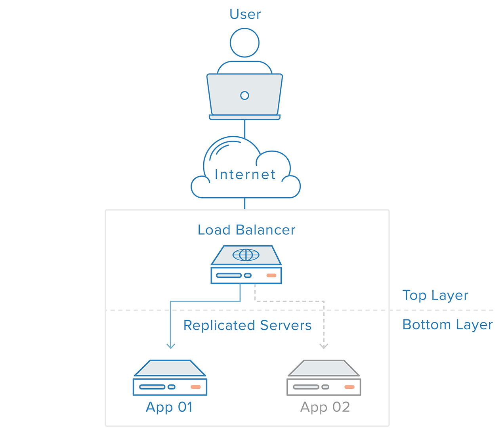
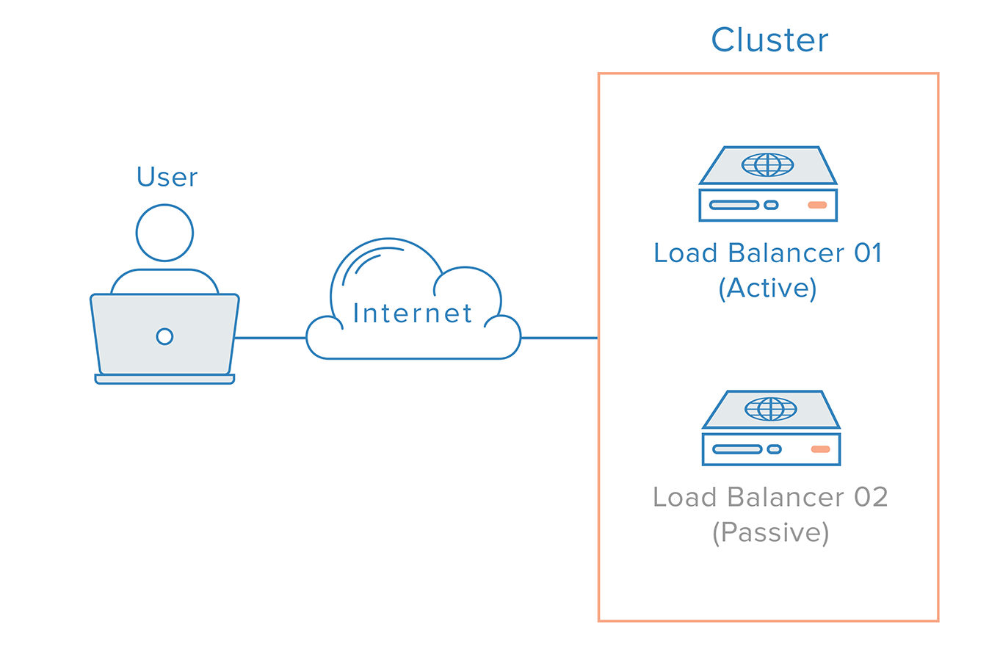

# HA là gì?

### ***Mục lục***

[1.  Giới thiệu](#1)

[2.	HA là gì?](#2)

[3.	Định lượng tính sẵn sàng](#3)

[4.	HA quan trọng khi nào?](#4)

[5.	Các tiêu chí của hệ thống có HA](#5)

[6.	Một số phần mềm cấu hình HA cho hệ thống](#6)

[7. Tài liệu tham khảo](#7)

---

# 1. Giới thiệu

- Với nhu cầu nâng cao việc thiết kế cơ sở hạ tầng đáng tin cậy với hiệu năng cao để phục vụ cho các hệ thống quan trọng, các thuật ngữ về khả năng mở rộng (scalability) và mức độ khả dụng cao hay tính sẵn sàng cao (High Availability) không thể không phổ biến hơn bao giờ hết. Việc xử lý tải hệ thống ngày càng tăng đang là một vấn đề được quan tâm chung., việc làm giảm thời gian downtime và loại bỏ các vấn đề SPOF (Single point of failure) cũng đang dần trở nên hết sức quan trọng. 

- HA được xem là chất lượng cho việc thiết kế cơ sở hạ tầng theo quy mô nhằm giải quyết các điều cần cân nhắc đã và đang tồn tại trong hệ thống. 

# 2.	HA là gì?

- Cụm từ **Availability** được sử dụng để mô tả cho khoảng thời gian khi mà một dịch vụ có thể sử dụng được cũng giống như khoảng thời gian yêu cầu của hệ thống để có thể đáp ứng đối với những yêu cầu được tạo ra bởi người dùng.

- **High Availabily** là chất lượng của một hệ thống hoặc một bộ phận đảm bảo mức độ hoạt động trong khoảng thời gian nhất định. 

# 3. Định lượng tính sẵn sàng

- Được biểu diễn bằng chỉ số phần trăm (%) cho biết thời gian hoạt động dự kiến cho mọt hệ thống cụ thể hay một bộ phận của hệ thống trong một khoảng thời gian cụ thể là bao nhiêu.

- Nếu giá trị là 100% thì có nghĩa là hệ thống luôn sẵn sàng và không bao giờ xảy ra tình trạng ngừng hoạt động. 

- Ví dụ: một hệ thống có tính sẵn sàng là 99% trong một năm, thì có nghĩa là hệ thống có thể có thời gian ngừng hoạt động là 3.65 ngày.

- Các giá trị này được tính toán dựa trên một số yếu tố bao gồm cả thời gian bảo trì theo kế hoạch và không theo lịch cũng như thời gian để phục hồi một lỗi hệ thống có thể xảy ra.

# 4.	HA quan trọng khi nào?

- Khi các thiết lập hệ thống hoạt động một cách mạnh mẽ, giảm thiểu thời gian ngừng hoạt động và thời gian gián đoạn dịch vụ thường được xem là những ưu tiên cao. Bất kể hệ thống và phần mềm của bạn có đáng tin cậy hay không, các vấn đề có thể xảy ra có thể làm gián đoạn các ứng dụng hoặc các máy chủ.

- Triển khai HA cho cơ sở hạ tầng của bạn là một chiến lược hữu ích để giảm tác động của các loại sự cố. Các hệ thống HA có thể phục hồi các hệ thống hoặc các thành phần của hệ thống bị hư hỏng một cách tự động.

# 5.	Các tiêu chí của hệ thống có HA

- Loại bỏ các SPOF, mỗi layer của stack phải được chuẩn bị cho việc dự phòng. Ví dụ: bạn có một cơ sở hạ tầng bao gồm 2 máy chủ web giống hệt nhau, đằng sau được dự phòng là một load balancer. Lư lượng đến từ các client sẽ được phân bố đều đến các máy chủ web. Nhưng nếu một trong các máy chủ web bị dừng hoạt động, load balancer sẽ thực hiện chuyển hướng các lưu lượng một cách trực tiếp đến máy chủ web còn lại. 

	

- Tuy nhiên, hệ thống chỉ có một load balancer lại cũng có nguy cơ là một SPOF vì nó không có dự phòng. Với trường hợp như vậy, việc tiếp cần một cách phân tán là cần thiets. Nhiều máy chủ dự phòng phải được kết nối với nhau tại cùng một nơi và mỗi máy chủ nên có khả năng phát hiện và khắc phục lỗi. 

	

- Với giải pháp này, tuy nhiên lại có một vấn đề với cách làm việc của nameservers. Để giải quyết vấn đề này, có một giải pháp là sử dụng địa chỉ IP một cách linh hoạt giống như sử dụng các địa chỉ Floating IP. Việc ánh xạ lại đại chỉ IP sẽ loại bỏ các vấn đề về quảng bá và caching vốn có trong các thay đổi của DNS bằng cách cung cấp một địa chỉ IP tĩnh mà có thể dễ dàng sửa đổi lại khi cần thiết. Tên miền vẫn có thể được liên kết với cùng một địa chỉ IP, trong khi địa chỉ này có thể linh hoạt di chuyển được hay có thể được sử dụng giữa các máy chủ.

	- Đây là cách mà cơ sở hạ tầng có HA sử dụng floating IP :

		

# 6.	Một số phần mềm cấu hình HA cho hệ thống

- Haproxy là sự lựa chọn phổ biến cho các loại máy chủ khác nhau, bao gồm cả các máy chủ đảm nhiệm chức năng làm cơ sở dữ liệu.

- Corosync và Pacemaker là lựa chọn phổ biến cho việc triển khai cân bằng tải và sử dụng một floating IP.

# 7. Tài liệu tham khảo

[1] https://www.digitalocean.com/community/tutorials/an-introduction-to-haproxy-and-load-balancing-concepts#haproxy-terminology