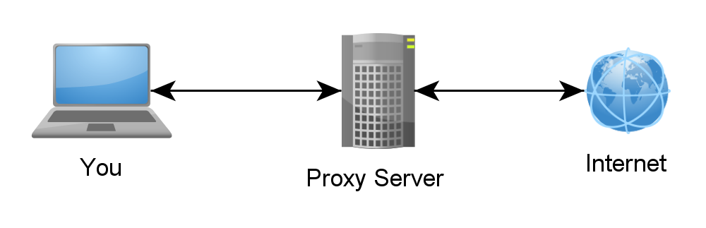
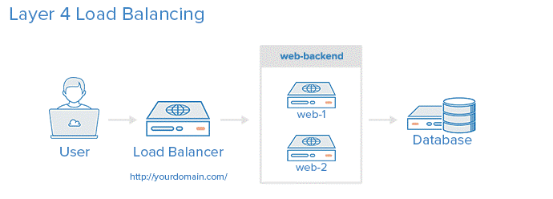
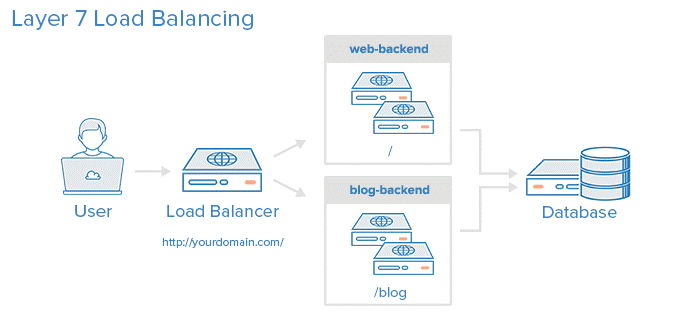

# TỔNG QUAN VỀ HAPROXY

### ***Mục lục***
[1.	Một số khái niệm trong HAproxy](#1)

- [1.1. Proxy](#1.1.)

- [1.2. Access Control List (ACL)](#1.2)

- [1.3. Backend](#1.3)

- [1.4. Frontend](#1.4)

[2.	Khái quát Cân bằng tải – Load balancing](#2)

- [2.1. Giới thiệu chung về cân bằng tải](#2.1)

- [2.2. Các kỹ thuật cân bằng tải](#2.2)

- [2.3. Phân loại cân bằng tải](#2.3)

	- [2.3.1 No Load Balancing – Không có cân bằng tải](#2.3.1)

	- [2.3.2. Layer 4 Load Balancing – Cân bằng tải lớp 4](#2.3.2)

	- [2.3.3. Layer 7 Load Balancing – Cân bằng tải lớp 7](#2.3.3)

- [2.4. Các thuật toán cân bằng tải](#2.4)

[3.	Sticky Sessions](#3)

[4.	Health Check](#4)

[5.	Keepalived](#5)

[6. Tài liệu tham khảo](#6)

---

<a name = '1'></a>
# 1.	Một số khái niệm trong HAproxy

<a name = '1.1'></a>
## 1.1. Proxy

- Proxy là một Internet server làm nhiệm vụ chuyển tiếp thông tin và kiểm soát tạo sự an toàn cho việc truy cập Internet của các máy khách, còn gọi là khách hàng sử dụng dịch vụ Internet. 

- Proxy hay trạm cài đặt proxy có địa chỉ IP và một cổng truy cập cố định. 

- Các request trước khi được gửi tới server đích sẽ phải đi qua proxy server để proxy forward các request đó đi tùy theo cơ chế lọc gói phù hợp.

	

- Về cách thức hoạt động nói chung,   thường phân ra 2 loại proxy như sau: 

	-	***Forward proxy***: Là khái niệm proxy chúng ta dùng hàng ngày, nó là thiết bị đứng giữa 1 client và tất cả các server mà client đó muốn truy cập vào.

	-	***Reverse proxy***: là 1 proxy ngược, nó đứng giữa 1 server và tất cả các client và server mà server đó phục vụ, tương tự 1 nhà ga kiêm 1 trạm kiểm soát, các yêu cầu từ client gửi lên server bắt buộc phải ghé vào reverse proxy, tại đây yêu cầu sẽ được kiếm soát, lọc bỏ, và luân chuyển đến server. Ưu điểm của nó là khả năng quản lý tập trung, giúp chúng ta có thể kiếm soát mọi yêu cầu do client gửi lên server mà chúng ta cần bảo vệ.

- HAproxy là phần mềm cân bằng tải TCP/HTTP và là giải pháp reverse proxy mã nguồn mở phổ biến, thường được sử dụng kết hợp với keepalived đem lại 1 giải pháp high availability hữu hiệu với giá thành thấp hơn so với việc sử dụng các giải pháp cân bằng tải khác (dựa trên phần cứng).

<a name = '1.2'></a>
## 1.2. Access Control List (ACL)

- ACLs được sử dụng để kiểm tra một số điều kiện và thực hiện một hành động (action) (ví dụ: chọn một server, hoặc block một request) dựa trên kết quả kiểm tra.

- Sử dụng ACLs cho phép chuyển tiếp các lưu lượng mạng  một cách linh hoạt dựa trên sự đa dạng trong việc kết hợp kết quả match phù hợp và số lượng kết nối tới một backend. 

- Ví dụ: 

	```
	acl url_blog path_beg /blog
	```

	ACL này sẽ match nếu đường dẫn của request từ user bắt đầu với `/blog`. Tức là giả sử match với request như sau: http://yourdomain.com/blog/blog-entry-1

<a name = '1.3'></a>
## 1.3. Backend

- Backend là các server mà nhận được các bản tin request tới. Các backend được định nghĩa trong section backend của file cấu hình HAproxy. Trong hầy hết các trường hợp, một backend có thể được định nghĩa bởi:

- Thuật toán cân bằng tải được sử dụng

- Danh sách các server và port.

- Một backend có thể duy trì thông tin về một hoặc nhiều server, thêm nhiều server vào backend để tăng khả năng xử lý tải bằng cách chia sẻ request trên nhiều server. Đồng thời làm tăng độ tin cạy, trong trường hợp một số máy chủ backend trở nên không khả dụng.

- Ví dụ: cấu hình 2 backend `web-backend` và `blog-backend` với 2 server mỗi backend, lắng nghe trên cổng 80 như sau:

	```
	backend web-backend
	   balance roundrobin
	   server web1 web1.yourdomain.com:80 check
	   server web2 web2.yourdomain.com:80 check

	backend blog-backend
	   balance roundrobin
	   mode http
	   server blog1 blog1.yourdomain.com:80 check
	   server blog1 blog1.yourdomain.com:80 check
	```
	Trong đó: 

	-	`balance roundrobin` dùng để cấu hình sử dụng thuật toán **roundrobin**. 

	-	`mode http` xác định sẽ proxy layer 7.

	-	Tùy chọn `check` ở cuối mỗi server chỉ ra sẽ thực hiện kiểm tra trạng thái của các server backend (check trạng thái vẫn còn hoạt động thì mới forward request tới)

<a name = '1.4'></a>
## 1.4. Frontend

- Frontend định nghĩa cách mà request được forward tới các backend; được định nghĩa trong section frontend trong file cấu hình của HAproxy. Định nghĩa về frontend bao gồm các phần sau:

	-	Thiết lập địa chỉ IP và port cho proxy

	-	ACLs

	-	Các quy tắc `use_backend`, xác định các backend nào được sử dụng, phụ thuộc vào điều kiện match với ACL, và/hoặc một `default_backend` mặc định cho các trường hợp còn lại nếu không cấu hình.

- Một frontend có thể được cấu hình đa dạng nhiều loại lưu lượng.

<a name = '2'></a>
# 2.	Khái quát Cân bằng tải – Load balancing

<a name = '2.1'></a>
## 2.1. Giới thiệu chung về cân bằng tải

- **Load Balancing** bao gồm việc kết hợp lại nhiều thành phần để có được tổng hợp khả năng xử lí trên các thiết bị riêng lẻ. Như vậy, sẽ có nhiều quá trình xử lí diễn ra trong cùng thời gian mà nó xử lí một tiến trình riêng lẻ.

- Lợi ích chính của load balancing đó là sử dụng hết tất cả tài nguyên để đem lại hiệu suất tốt nhất. Ví dụ ngoài đời thường, một tuyến đường có nhiều làn sẽ cho phép nhiều xe đi qua hơn trong cùng một thời điểm mà không cần phải tăng tốc độ của các xe chạy qua.

- Ví dụ của load balancing:

	-	Quá trình schedule của hệ thống với nhiều vi xử lí xử lý đa nhiệm.

	-	EtherChannel, Bonding

	-	......

- Thành phần thực hiện các load balancing operations được gọi là load balancer. Một trong những use case áp dụng load balancing, tốt nhất đó là môi trường web.

- Load balancer có thể hoạt động ở các mức:
	-	*Link level*: quyết định card mạng để gửi gói tin (Ví dụ: EtherChannel )

	-	*Network level*: quyết định đường mạng để gửi gói tin đi 

	-	*Server level* : quyết định server nào sẽ xử lí request

- Có hai công nghệ thực hiện điều này và mỗi thứ lại cần những điều kiện nhất định.

	-	Loại thứ nhất hoạt động ở packet level. Mối quan hệ giữa input và output packet là 1-1. Nó có thể hoạt động stateful (layer 4) và phù hợp nhất với network-level load balancing.

	-	Loại thứ 2 hoạt động trên các nội dung của phiên làm việc. Nội dung có thể được thay đổi và output stream được phân lại thành các packets khác nhau. Loại này thường hoạt động bằng proxies và được gọi là layer 7 load balancer. Công nghệ này rất phù hợp với server load balancing.

<a name = '2.2'></a>
## 2.2. Các kỹ thuật cân bằng tải

- Các phần mềm cân bằng tải thường được cài đặt như một proxy, các kỹ thuật cần phải chú trọng đó là: kiểm tra trạng thái server (`health checks`), lựa chọn server tốt nhất để gửi yêu cầu và kỹ thuật duy trì kết nối của người dùng.

	-	Kiểm tra trạng thái server trước khi forward request tới: có thể bằng lệnh ping hoặc một phương pháp khác.

	-	Lựa chọn server tốt nhất: dựa trên các thuật toán cân bằng tài.

	-	Kĩ thuật Session Persistence: duy trì kết nối cho các yêu cầu của người dùng trong suốt phiên làm việc, tất cả các yêu cầu của người dùng cần phải chuyển đến cùng một server, nếu server chết hoặc ngừng để bảo trì, cần có cơ chế để chuyển session qua 1 server khác, cookie là phương pháp được sử dụng.

<a name = '2.3'></a>
## 2.3. Phân loại cân bằng tải

<a name = '2.3.1'></a>
### 2.3.1. No Load Balancing – Không có cân bằng tải


- Người dùng kết nối trực tiếp tới web server, tại địa chỉ: http://yourdomain.com và không có cân bằng tải. Nếu web server đó bị down, người dùng sẽ không thể truy cập tới web server. 

- Hơn nữa, nếu có quá nhiều người dùng cùng cố truy cập đồng thời vào web server thì nó sẽ không thể xử lý hết được tải, có thể dẫn tới xử lý chậm hoặc có thể dẫn tới tất cả người dùng không thể truy cập tới web server. 

<a name = '2.3.2'></a>
### 2.3.2. Layer 4 Load Balancing – Cân bằng tải lớp 4

- Cách đơn giản nhất để cân bằng tải lưu lượng mạng tới các server là sử dụng cân bằng tải ở lớp 4 ( transport layer). 

- Cân bằng tải theo các này sẽ forward lưu lượng ngừi dùng dựa trên dải địa chỉ IP và port (ví dụ: nếu một request đến từ http://yourdomain.com/anything, lưu lượng sẽ được chuyển tiếp tới backend mà xử lý cho tất cả các request cho web yourdomain.com trên cổng 80). 

	

- Người dùng truy cập tới load balancer, request được forward tới `web-backend`. Backend server nào được chọn sẽ hồi đáp trực tiếp request của người dùng. Thường, tất cả các server trong `web-backend` nên phục vụ một nội dung giống nhau – nếu không thì người dùng có thể sẽ không nhận được nội dung một cách nhất quán. Lưu ý là tất cả web server kết nối tới cùng một database.

<a name = '2.3.3'></a>
### 2.3.3.  Layer 7 Load Balancing – Cân bằng tải lớp 7

- Một cách khác phức tạp hơn để thực hiện cân bằng tải là sử dụng cân bằng tải lớp 7 (tầng ứng dụng). Việc sử dụng layer 7 cho phép Load Balancer chuyển tiếp các request tới các backend khác nhau dựa trên nội dung request của người dùng. Kiểu này cho phép bạn chạy nhiều máy chủ web dưới cùng một domain và port.

	

- Ở ví dụ này, nếu một người dùng request tới địa chỉ `yourdomain.com/blog`, chúng sẽ được chuyển tiếp tới backend blog, nơi mà được thiết lập để chạy ứng dụng blog. Các request khác được forward tới web-backend, có thể chạy các ứng dụng khác. Tất cả backend sử dụng chung database server.

- Cấu hình trong file cấu hình HAproxy sẽ như sau:

	```
	frontend http
	  bind *:80
	  mode http

	  acl url_blog path_beg /blog
	  use_backend blog-backend if url_blog

	  default_backend web-backend
	```

	-	`frontend` tên `http`, là frontend xử lý tất cả các lưu lượng đến trên port 80.

	-	`acl url_blog path_beg /blog` match với một request nếu như đường dẫn request của người dùng bắt đầu với `/blog`

	-	`use_backend blog-backend if url_blog` sử dụng ACL để proxy lưu lượng tới `blog-backend`.

	-	`default_backend web-backend` xác định cho tất cả các lưu lượng khác (còn lại, không match) sẽ được chuyển tiếp tới `web-backend`.

<a name = '2.4'></a>
## 2.4. Các thuật toán cân bằng tải

- Thuật toán cân bằng tải được sử dụng để quyết định xem server nào, trong backend sẽ được chọn khi cân bằng tải. HAproxy cho phép vài tùy chọn cho các thuật toán. Ngoài ra, các server có thể được chỉ định một tham số trọng lượng để điều khiển tần suất máy chủ được chọn, so với các máy chủ khác.

- Một vài thuật toán phổ biến:

	-	**roundrobin** : thực hiện xoay vòng việc lựa chọn các server. Giả sử backend có 2 webserver thì request thứ nhất sẽ đi vào webserver 1,  request thứ 2 sẽ đi vào webserver 2, request thứ 3 đi vào webserver 1, cứ thế như thế quay vòng, theo hình thức chia bài, nếu có nhiều hơn 2 server, thì cũng quay vòng tương tự.
	
		Thuật toán **Weighted Round Robin (Ratio)**: tương tự như RR nhưng có quan tâm đến khả năng xử lý của các server, trong 1 chu kỳ 1 server có khả năng xử lý gấp đôi server khác sẽ nhận được gấp đôi số yêu cầu từ phía bộ cân bằng tải.

	-	**static-rr**: Tương tự như đối với roundrobin, traffic đi vào cũng sẽ được các máy chủ web chia nhau xử lý, tuy nhiên nâng cao hơn chút đó là mỗi máy chủ web được đánh 1 trọng số riêng, chỉ định lượng traffic mà nó xử lý. Ví dụ web server 1 đánh trọng số = 70, web 2 đánh trọng số = 30, thì 70% traffic đi vào web1, 30% còn lại đi vào web 2. Thuật toán này được sử dụng để chia tải giữa những server backend có cấu hình khác xa nhau.

	-	**leastconn**  : request sẽ được ưu tiên đưa vào máy chủ có ít kết nối nhất

	-	**first**: Mỗi máy chủ được đặt 1 ngưỡng, Máy chủ đầu tiên có số lưỡng kết nối chưa đạt ngưỡng sẽ được sử dụng, khi nó đạt ngưỡng thì sẽ chuyển sang máy chủ thứ 2, 3 ...

	-	**Source**: Thuật toán này quyết định server nào sẽ xử lý request bằng cách hash source IP sau đó chia cho tổng weight của server. Điều này sẽ giúp ích nếu ta không muốn một request của 1 client sẽ xử lý qua nhiều server (Tức là server nào xử lý request của client nào thì sẽ giữ như vậy và không thay đổi) dĩ nhiên là server đó vẫn còn đang chạy.

	-	**uri** : Thuật toán này cũng giống như source, tuy nhiên giá trị hash ở đây sẽ là url (không có parameter). Việc này giúp ích nếu ta muốn các URL giống nhau sẽ chỉ được xử lý bởi một server.

	-	**url_param**: Giống như trên, tuy nhiên url sẽ bao gồm luôn parameter

<a name = '3'></a>
# 3.	Sticky Sessions

Một số ứng dụng yêu cầu người dùng tiếp tục kết nối tới backend server. Việc duy trì lâu dài này đạt được thông qua sticky session, cấu hình tham số appsession trong backend.

<a name = '4'></a>
# 4.	Health Check

- HAProxy dùng `health check` để xác định xem 1 máy chủ trong backend có đang sẵn sàng xử lý request hay không. Điều này tránh việc loại bỏ 1 máy chủ một cách thủ công khỏi backend nếu nó không sẵn sàng. Mặc định `health check` tạo 1 kết nối TCP đến máy chủ, ví dụ nó kiểm tra xem 1 máy chủ backend có đang lắng nghe trên IP address và port đã được cấu hình hay không.

- Nếu một máy chủ không đáp ứng `health check`, thì nó sẽ không thể xử lý request, nó được tự động vô hiệu hóa trong backend. Ví dụ lưu lượng sẽ không được chuyển hướng đến nó cho tới khi nó sẵn sàng hoạt động trở lại. Nếu tất cả các máy chủ trong backend lỗi, dịch vụ sẽ không sẵn sàng cho đến khi ít nhất 1 máy chủ trong backend sẵn sàng phục vụ.

- Đối với 1 số loại backend nhất định, như máy chủ cơ sở dữ liệu, `health check` mặc định là không đủ để xác định máy chủ vẫn còn làm việc tốt hay không.

<a name = '5'></a>
# 5.	Keepalived

- Cân băng tải lớp 4 và lớp 7 vừa trình bày trên đều sử dụng cân bằng tải bằng cách chuyển hướng trực tiếp tới một hoặc  nhiều server backend. Tuy nhiên, chính Load Balancer lại chính là một điểm duy nhất trong hệ thống, do đó nếu nó bị lỗi hoặc có quá nhiều kết nối đến thì nó có thể dấn tới trễ cao hoặc bị downtime. 

- Hệ thống HA phải là một hệ thống mà không có một điểm chết duy nhất. Nó sẽ ngăn chặn việc chỉ có một máy chủ cân bằng tải xử lý khỏi bị downtime bằng cách tăng tính phòng bị tới tất cả các layer trong kiến trúc của bạn. Một Load Balancer có khả năng dự bị tốt cho backend layer (web/app server), nhưng phải được thiết lập tính sẵn sàng cao, cần phải cấu hình loadbalancer dự phòng tốt.
Keepalive được sử dụng để giải quyết vấn đề này.

- Keepalive là 1 phần mềm định tuyến được viết bằng C, cung cấp 1 công cụ đơn giản và mạnh mẽ cho việc cần bằng tải và HA cho hệ thống. Nói đơn giản hơn là keepalived dùng để cung cấp IP Failover cho 1 cluster. Cho phép 2 bộ cân bằng tải cài đặt cùng với nó hoạt động theo cơ chế active/backup.

	

<a name = '6'></a>
# 6. Tài liệu tham khảo

[1] Introduction HAproxy and Load balancing: https://www.digitalocean.com/community/tutorials/an-introduction-to-haproxy-and-load-balancing-concepts#types-of-load-balancing

[2] Introduction HAproxy: http://cbonte.github.io/haproxy-dconv/1.9/intro.html

[3] http://itnetworkvietnam.blogspot.com/2016/10/tim-hieu-ve-haproxy-giai-phap-can-bang.html

[4] https://dienpt.com/can-bang-tai-haproxy/