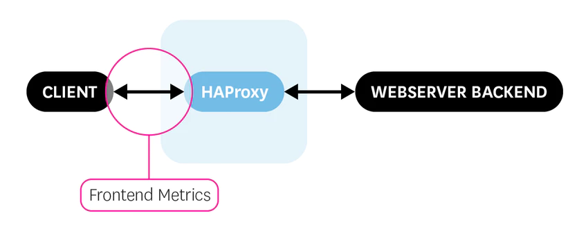
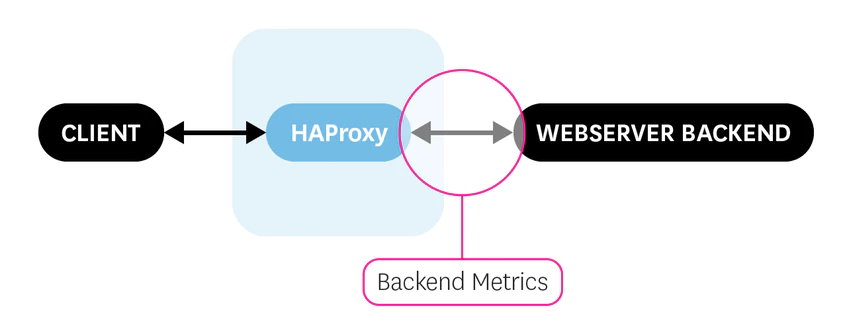
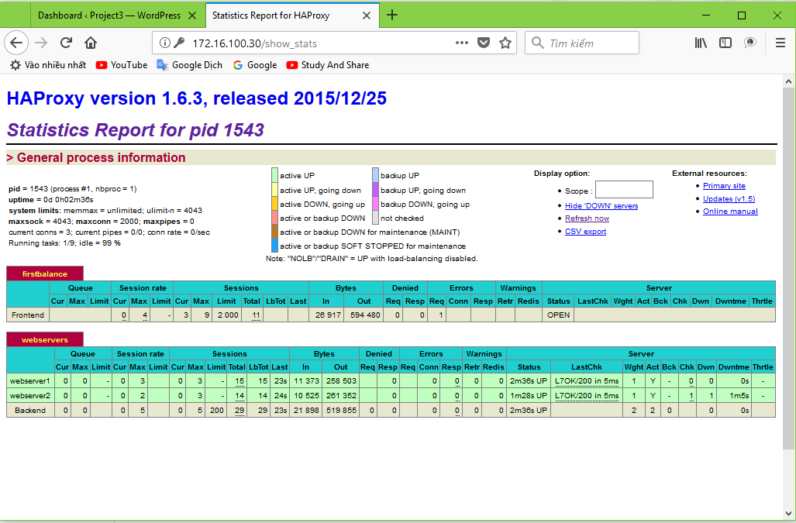
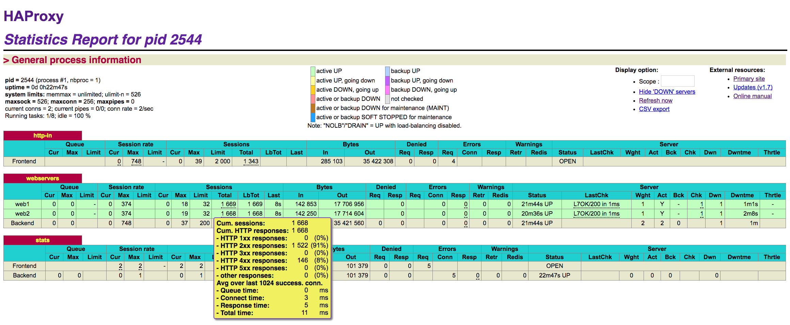

# PHÂN TÍCH HAPROXY

### ***Mục lục***

[1.  Các khả năng của HAproxy ](#1)

[2.  Cách thức hoạt động](#2)

[3.  Cài đặt HAproxy trên ubuntu](#3)

[4.  Cấu hình HAproxy ](#4)

- [4.1. Các tham số trong section “global” ](#4.1)

- [4.2. Cấu hình trong các section proxy ](#4.2)

- [4.3. Sử dụng giao diện phân tích luồng lưu lượng](#4.3)

[5. Tham khảo](#5)

---

<a name = '1'></a>
# 1. Các khả năng của HAproxy

HAproxy có thể đóng vai trò thực hiện các chức năng sau:

- Là một **TCP proxy** : nó có thể chấp nhận một kết nối TCP từ một socket đang lắng nghe, kết nối tới một server và gán những socket cùng với các luồng lưu lượng chuyển tới các hướng.

- Là một **HTTP reverse-proxy**: đóng vai trò như "gateway" trong HTTP - nó đại diện cho server, nhận được các HTTP request từ client thông qua các kết nối đã được phép trên TCP socket đang lắng nghe. Tức nó sẽ kiểm duyệt các request trước khi forward các request đó tới server để xử lý. 

- Có khả năng tạo, kết thúc và giảm tải cho SSL: SSL/TLS có thể được sử dụng trong các kết nối đến từ client, trên các kết nối tới server hoặc cả 2 kết nối trên.

- TCP normalizer, HTTP normalizer.

- Công cụ chỉnh sửa HTTP: Có thể chỉnh sửa, thêm, xóa hoặc viết lại URL hoặc phần header của bất kì request hoặc response nào. Điều này giúp khắc phục các vấn đề về khả năng tương tác trong môi trường phức tạp.

- Chuyển tiếp dựa trên nội dung (**content-based switch**): Cân nhắc các yếu tố trong request để quyết định xem server nào sẽ nhận được request hoặc kết nối tới. Do đó nó có thể xử lý nhiều giao thức thông qua một port (như http, https, ssh)

- Đóng vai trò cân bằng tải: có thể thực hiện cân bằng tải các kết nối TCP và request HTTP. Với TCP, cân bằng tải quyết định cho toàn bộ kết nối. Với HTTP, quyết định sẽ tùy vào từng request (dựa vào nội dung request)

- Điều chỉnh lưu lượng: nó có thể hạn chế tốc độ tại nhiều điểm, bảo vệ các server khỏi bị quá tải, ưu tiên lưu lượng dựa trên nội dung của request.

- Bảo vệ khỏi tấn công DDoS: nó có thể duy trì một số lượng lớn thông tin thống kê trên mỗi địa chỉ IP, URL, cookie, ... và phát hiện khi có một "abuse" đang xảy ra (và xử lý bằng cách làm chậm, block hoặc gửi những nội dung đã hết hạn...)

- Cung cấp khả năng theo dõi cho việc xử lý sự cố mạng.

- Thông tin báo cáo trong các bản ghi, nó thường được sử dụng để thu hẹp phạm vi các vấn đề liên quan đến mạng.

- Giảm tải bằng cách nén lưu lượng: có thể nén các response mà chưa được nén bởi server, do đó cắt giảm thời gian tải trang cho những client có kết nối yếu hoặc sử dụng trong các mạng có độ trễ cao, mạng di động.

Tuy nhiên, cần hiểu rõ: HAproxy :

- **Không phải là một reverse proxy** - tức là proxy nằm gần phía người dùng mà các trình duyệt sử dụng để ra ngoài Internet. Có phần mềm chuyên dụng cho chức năng này như Squid. Tuy nhiên HAproxy có thể được cài đặt trước một con proxy như vậy để giảm tải cho nó và nâng cao tính sẵn sàng.

- **Không là một caching proxy**: nó sẽ trả về như nội dung mà nó nhận được từ server và sẽ không làm nhiễu tới các chính sách caching. 

- **Không chỉnh sửa tới dữ liệu**: không chỉnh sửa được phần body của request hoặc response - tức là chỉ đụng được tới phần header.

- **Không là web server**: không xử lý được như web server, mà chỉ thao tác và chuyển tiếp các request nên trên HAproxy không cài đặt các phần mềm web server. (tránh nhầm lẫn)

- **Không là kiểu cân bằng tải dựa trên gói tin**: Không nhìn vào địa chỉ IP hoặc phần datagram UDP, không thực hiện NAT và thậm chỉ cả định tuyến động.

<a name = '2'></a>
# 2.  Cách thức hoạt động

- HAproxy được thiết kế với mục đích chính là forward dữ liệu càng nhanh càng tốt, kiến trúc của nó được tối ưu hóa để chuyển dữ dữ liệu nhanh nhất có thể với ít thao tác nhất. Được thiết kế thành mô hình phân lớp với những cơ chế riêng tại mỗi level để đám bảo dữ liệu không phải đi lên layer cao hơn nếu không cần thiết. 

- Thông thường, trong suốt quá trình xử lý: 15% là ở HAproxy và 85% trong kernel với các kết nối TCP, và khoảng 30% ở haproxy và 70% ở kernel khi hoạt động ở ở chế độ HTTP keep-alived. 
HAproxy chỉ yêu cầu xử lý haproxy và một file cấu hình để chạy. Các file cấu hình sẽ được phân tích trước khi khởi động, và HAproxy sẽ thử bind tới tất cả các socket đang lắng nghe, và sẽ từ chối khởi động nếu có lỗi. Để ghi lại log cần phải cấu hình syslog daemon.

- Quá trình thực hiện của HAproxy:
        -       Xử lý các kết nối đến
        -       Thực hiện check đều đặn để biết trạng thái các server (health check)
        -       Thay đổi thông tin với các mode HAproxy khác.

- Quá trình xử lý các kết nối đến:
        -       Chấp nhận các kết nối đến từ các socket đang lắng nghe mà thuộc về một entity được cấu hình như là “frontend” 
        -       Áp dùng các quy tắc xử lý của frontend với các kết  nối đó.
        -       Đưa các kết nối tới phần xử lý backend.
        -       Áp dụng các quy tắc xử lý của backend tương ứng.
        -       Quyết định lựa chọn server để chuyển tiếp kết nối đến theo chiến lược cân bằng tải.
        -       Áp dụng các quy tắc xử lý của backend với response được trả về từ server. 
        -       Áp dụng các quy tắc xử lý của frontend với response.
        -       Tạo log để ghi lại những gì đã xảy ra.
        -       Với http, thực hiện vòng lại từ bước 2 với một request mới hoặc đóng phiên kết nối.

<a name = '3'></a>
# 3.  Cài đặt HAproxy trên ubuntu

Sử dụng lệnh sau để cài đặt HAproxy:

```
apt-get install haproxy -y
```

<a name = '4'></a>
# 4.      Cấu hình HAproxy

Quá trình xử lý cấu hình HAproxy bao gồm 3 nguồn thông số chính: 

- Cấu hình thông qua dòng lệnh, là cách được ưu tiên trước. (đã thử nhưng không hiểu sao chưa thấy có hiệu quả @@)

- Các cấu hình trong phần section “global” của file config: thiết lập các tham số xử lý có ảnh hưởng cục bộ

- Các cấu hình trong các section proxy: lấy từ **“defaults”**, **"listen"**, **"frontend"** và **"backend"**.

<a name = '4.1'></a>
## 4.1. Các tham số trong section “global” 

- Chi tiết các tham số tham khảo [tại đây](http://cbonte.github.io/haproxy-dconv/1.9/configuration.html#3)

- Một số cấu hình:

	- Cấu hình đẩy log:

		```
		log /dev/log    local0
		log /dev/log    local1 notice
		```

	- Cấu hình ghi lại các thông số thống kê các kết nối qua HAproxy để tiện phân tích

		```
		stats socket /run/haproxy/admin.sock mode 660 level admin
		stats timeout 30s
		```

<a name = '4.2'></a>
## 4.2. Cấu hình trong các section proxy
 
- Cấu hình cho proxy có thể bao gồm các tập section sau: 
	- defaults [<name>]

	- frontend <name>

	- backend  <name>

	- listen   <name>

- Trong đó: 

	- **defaults** thiết lập các thông số mặc định cho tất cả các section khác sau nó khai báo. Các thông số này có thể reset lại ở section default tiếp thep. Danh sách các tham số thiết lập trong default xem tại đây.

	- Một số tùy chọn tham số trong default: 

		- `log     global` : cấu hình cho phép ghi lại log

		- `mode    http` : mặc định hoạt động cân bằng tải cho các request http.

		- `timeout connect 5000` : cấu hình thời gian timeout là 5000ms

		- `timeout client  50000` : thời gian timeout request của client là 50000ms

		- `timeout server  50000` : thời gian timeout response của server là 50000ms

		- Các cấu hình chỉ ra đường dẫn chứa thông tin hiển thị khi có lỗi xảy ra:

			- errorfile 400 /etc/haproxy/errors/400.http

			- errorfile 403 /etc/haproxy/errors/403.http

			- errorfile 408 /etc/haproxy/errors/408.http

			- errorfile 500 /etc/haproxy/errors/500.http

			- errorfile 502 /etc/haproxy/errors/502.http

			- errorfile 503 /etc/haproxy/errors/503.http

			- errorfile 504 /etc/haproxy/errors/504.http

	- **frontend** Mô tả thiết lập các socket lắng nghe chấp nhận các kết nối từ client.

		

		Gồm tối thiểu các tham số sau:

		- Tên frontend
                
		- Socket lắng nghe của HAproxy: bind <IP_HAproxy>:<port>
                
		- Backend chứa thông tin backend mà request sẽ chuyển tới
                
		- Ví dụ: 

			```
			frontend firstbalance
			bind 172.16.100.30:80
			option forwardfor
			default_backend webservers
			```

	- **backend** : Mô tả thiết lập các server mà proxy sẽ chuyển tiếp các kết nối tới.

		

		- Gồm các tham số tối thiểu sau:  
                - Tên backend: `backend <name>`  
                - Thuật toán sử dụng để cân bằng tải : `balance <algorithm_name>`  
                - Thông tin các server trong backend để forward request tới. Thêm `check` để thực hiện health check các server.   
                
		- Ví dụ: 

			```
			backend webservers
			balance roundrobin
			server webserver1 10.10.10.100:80 check
			server webserver2 10.10.10.150:80 check
			option httpchk
			```

	- **listen** : định nghĩa các proxy đã hoàn thiện cả frontend và backend trong một section. Thường hữu ích cho lưu lượng TCP.


<a name = '4.3'></a>
## 4.3. Sử dụng giao diện phân tích luồng lưu lượng

- Để hiển thị giao diện thống kê (stats) lưu lượng qua HAproxy, ta cấu hình như sau:

- Thêm một số dòng sau vào trong file `/etc/haproxy/haproxy.cfg` ở setcion default

	```
	stats enable
	stats uri /show_stats
	stats auth admin:123456
	```

	Trong đó: `uri`: cấu hình đường dẫn uri cho giao diện hiển thị thống kê lưu lượng  
        	`auth`: cấu hình tải khoản xác thực cho phép vào xem được giao diện, (có thể đặt tùy ý người dùng).

- Restart lại HAproxy: 

	```
	systemctl restart haproxy.service
	```

- Theo dõi stats trên trình duyệt ta có như sau:

	

- Trên giao diện stats của HAproxy, ta thấy hiển thị các thông tin mà đã được cấu hình trong file `/etc/haproxy/haproxy.cfg`:

	- Thông tin về các backend và frontend có trong hệ thống: trạng thái từng thành phần (up, down, active, …)

	- Một số tham số global được cấu hình, hoặc  mặc định trong section global. 

	- Ý nghĩa các tham số hiển thị trên giao diện tham khảo thêm [tại đây](http://cbonte.github.io/haproxy-dconv/1.8/management.html#9.1)

	- Để biết thêm thông tin chi tiết, di chuột vào những phần có chấm chấm gạch dưới:

		

	- Để xuất ra báo cáo dưới dạng csv để tiện import cho máy được các thông số, click vào **CSV export**.

***Một số lab mà mình đã thực hiện tham khảo [tại đây](./4.Labs_HAproxy.md)***

<a name = '5'></a>
# 5. Tham khảo

[1] Introduction HAproxy: http://cbonte.github.io/haproxy-dconv/1.9/intro.html

[2] Global parameters : http://cbonte.github.io/haproxy-dconv/1.9/configuration.html#3 

[3] https://www.datadoghq.com/blog/monitoring-haproxy-performance-metrics/ 

