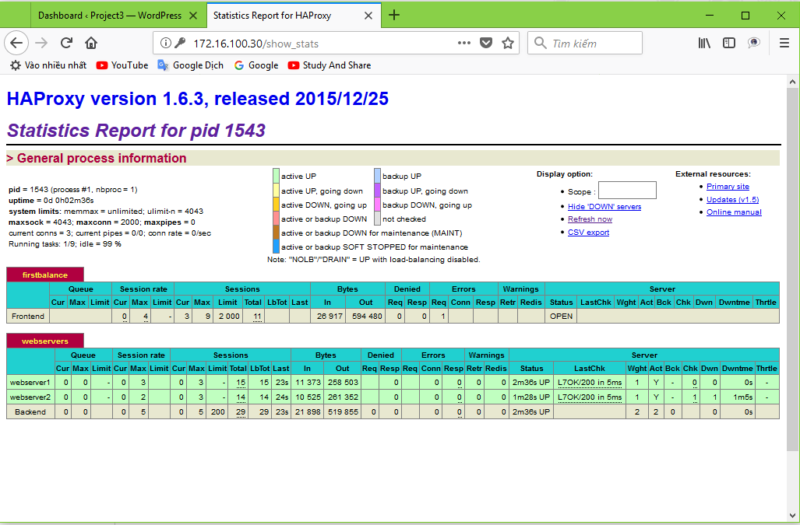

# MỘT SỐ BÀI LAB VỚI HAPROXY

### ***Mục lục***

[1.	HAproxy load balancing http](#1)

[2.	HAproxy load balancing SSH](#2)

[3. Tham khảo](#3)

---


<a name = '1'></a>
# 1.	HAproxy load balancing http

- Mô hình:


- Chuẩn bị:

    -	Dựng 2 web server cùng cài wordpress, sử dụng chung database như hình.

    -	Cài đặt và cấu hình IP như mô tả, thực hiện trên Ubuntu server 16.04. 

- Cấu hình HAproxy: sửa file /etc/haproxy/haproxy.cfg như sau:

    ```
    frontend firstbalance
            bind 172.16.100.30:80
            option forwardfor
            default_backend webservers

    backend webservers
            balance roundrobin
            server webserver1 10.10.10.100:80 check
            server webserver2 10.10.10.150:80 check
            option httpchk
    ```

    - Lưu lại và khởi động lại dịch vụ HAproxy. Ở đây sử dụng thuật toán round robin nên các request sẽ được gửi lần lượt cho 2 server xử lý. Khi một web server bị tắt, thì client vẫn truy cập tới dịch vụ web bình thường bởi web server con lại vẫn hoạt động.

    - Theo dõi giao diện thống kê lưu lượng của HAproxy sẽ thấy rõ:

        


    Số lượng request được chia đều cho 2 webserver (thể hiện ở số lượng byte in out trên cả 2 server mỗi khi có request đến)

<a name = '2'></a>
# 2. HAproxy load balancing SSH

Mô hình như trên, muốn cấu hình loadbalancing ssh, ta thêm cấu hình sau vào file `/etc/haproxy/haproxy.cfg`:


```
listen ssh-balanced
    bind 172.16.100.30:220
    mode tcp
    balance roundrobin
    server ssh1 10.10.10.100:22 check
    server ssh2 10.10.10.150:22 check
```

Restart lại dịch vụ HAproxy và kiểm tra, ssh vào IP 172.16.100.30 port 220. Ta được kết quả đúng lý thuyết. 

<a name = '3'></a>
# 3. Tham khảo

[1] https://devops.profitbricks.com/tutorials/install-and-configure-haproxy-load-balancer-on-ubuntu-1604/

[2] https://www.techrepublic.com/article/how-to-install-and-setup-haproxy-on-ubuntu-16-04/

[3] https://www.digitalocean.com/community/tutorials/how-to-use-haproxy-as-a-layer-4-load-balancer-for-wordpress-application-servers-on-ubuntu-14-04